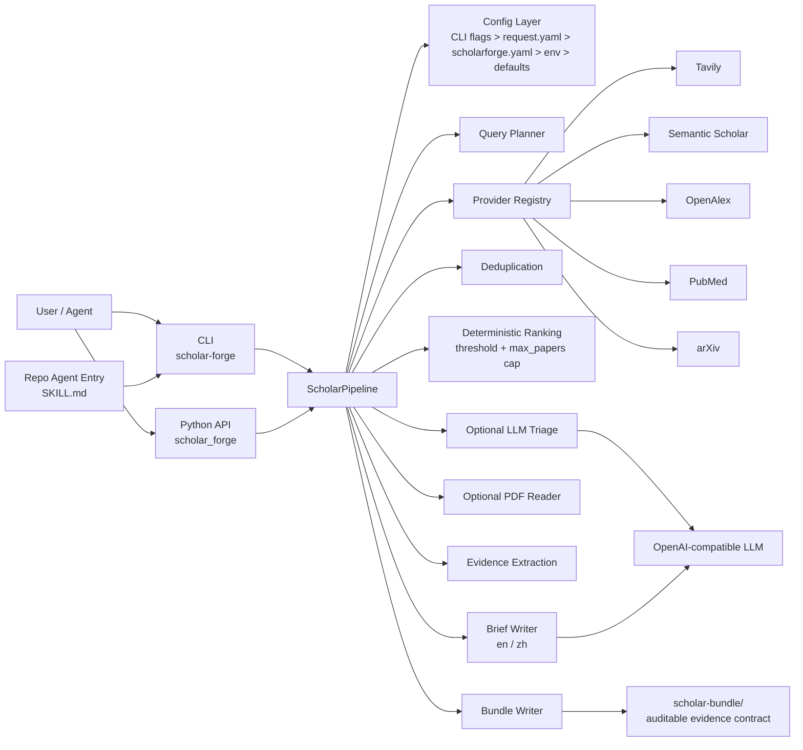
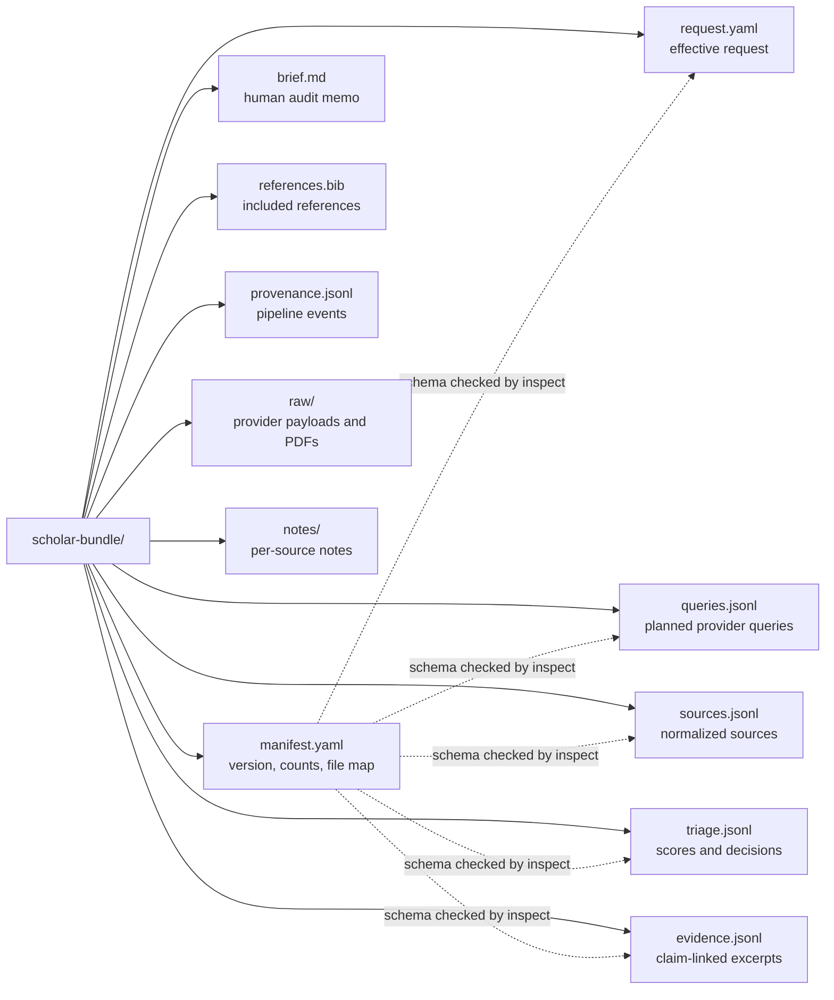
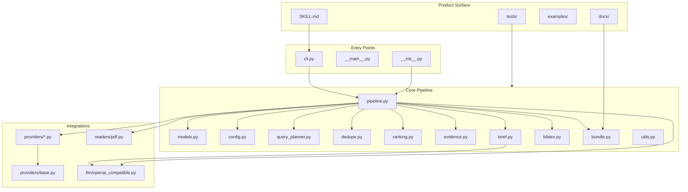

# ScholarForge Architecture Diagram

This diagram captures the current MVP architecture and execution route.

ScholarForge's product shape is:

```text
Research question in -> auditable evidence bundle out
```

## System Boundaries



## Pipeline Route

```mermaid
flowchart TD
    Start["ResearchRequest<br/>question, profile, domain, limits"] --> Defaults["Apply Defaults<br/>config + request merge"]
    Defaults --> Plan["Plan Queries<br/>queries.jsonl"]
    Plan --> Search["Search Providers<br/>raw/provider/*.json"]
    Search --> Normalize["Normalize Sources<br/>SourceRecord"]
    Normalize --> Dedupe["Deduplicate<br/>DOI / provider IDs / title fingerprint"]
    Dedupe --> Rank["Rank Sources<br/>keyword + evidence + recency + impact + profile"]
    Rank --> Threshold["Assign Decisions<br/>include / maybe / exclude"]
    Threshold --> MaybeLLM{"llm_triage?"}

    MaybeLLM -- "yes" --> LLMTriage["LLM Triage Override<br/>bounded by max_papers"]
    MaybeLLM -- "no" --> MaybePDF{"read_pdf?"}
    LLMTriage --> MaybePDF

    MaybePDF -- "yes" --> ReadPDF["Download + Extract Top PDFs<br/>pdf_text_preview"]
    MaybePDF -- "no" --> Evidence
    ReadPDF --> Evidence["Extract Evidence<br/>included sources only"]

    Evidence --> Sources["Write sources.jsonl"]
    Sources --> Triage["Write triage.jsonl"]
    Triage --> EvidenceFile["Write evidence.jsonl"]
    EvidenceFile --> Notes["Write notes/*.md"]
    Notes --> Brief["Write brief.md"]
    Brief --> Bib["Write references.bib"]
    Bib --> Manifest["Write manifest.yaml<br/>bundle_format_version: 1.0"]
    Manifest --> Done["Inspectable Bundle<br/>Files: ok / Schema: ok"]
```



## Bundle Contract



## Module Map


